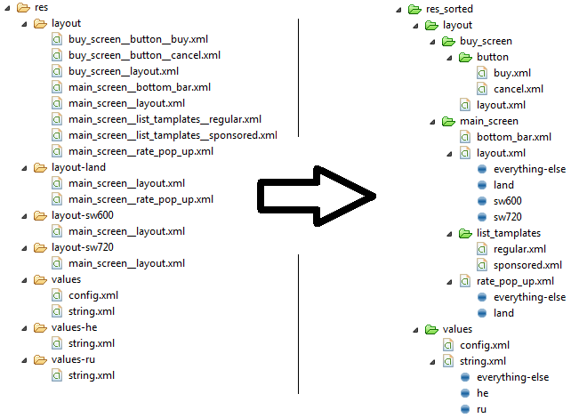

Android-Sorted-Res-Folder
=========================

The android framework doesn't allow you to have sub folder within the resources folder. this makes large project a complate mess.
this plugin adds a 'res-sorted' folder along side the regular 'res' folder. this folder is sorted in a more logical way.

* you create a virtual folder by breaking a name of a file with two underscores
* the same resource but with diffrent localization (locale,pixel density...) will be folder as the last node of the tree

Example:
=========================

